# Lazy-Balancer


项目起源于好哥们需要一个 7 层负载均衡器，无奈商业负载均衡器成本高昂，操作复杂。又没有特别喜欢（好看，好用）的开源产品，作为一名大 Ops 怎么能没有办法？正好最近在看 Django 框架，尝试自己给 Nginx 画皮，项目诞生！非专业开发，代码凑合看吧。

> * 项目基于 [Django](https://www.djangoproject.com/) + [AdminLTE](https://www.almsaeedstudio.com/) 构建，在 Ubuntu 14.04 上测试通过；为了保证良好的兼容性，请使用 Chrome 浏览器。
> * 为了后续扩展方便，请大家使用 [Tengine](http://tengine.taobao.org/) 替代 Nginx 服务

## 项目地址
- GITHUB - https://github.com/v55448330/lazy-balancer
- 码云 - http://git.oschina.net/v55448330/lazy-balancer
- OSCHINA - http://www.oschina.net/p/nginx-balancer

## 更新（2019-11-22）
* 新增 TCP 负载均衡支持
* 新增配置同步功能
* 支持后端服务器为 HTTPS 协议，当后端为 HTTPS 协议时，HTTP 健康检测将使用发送 SSL Hello 包的方式
* 支持域名后端，配置为域名后端时禁用节点配置
* 新增 HTTP/2，Gzip 等配置
* 增加 Docker 支持
* 去除原 iptables 防火墙管理功能
* 当协议为 HTTP/HTTPS 时，允许用户自定义 Server 级别 Nginx 配置
* 当协议为 HTTP/HTTPS 时，可以在列表页预览后端节点状态
* 当协议为 HTTP/HTTPS 时，允许用户自定义后端节点域名，当未定义时，转发用户输入的域名
* 当协议为 HTTPS 时，可以在列表页预览证书过期状态，及获取证书信息
* 允许后端节点为域名格式
* 增加 HTTP/80，HTTPS/443 的默认规则，禁止直接 IP 访问（返回444），证书路径在 `/etc/nginx/default.*`，可自行更换
* 新增允许非标准 HTTP Header 转发（如下划线_）
* 修复其他 Bug

## 更新
* 将 Nginx 更换为 Tengine 以提供更灵活的功能支持以及性能提升
* 新增 HTTP 状态码方式检测后端服务器，默认 TCP 方式
* 新增 HTTP 状态码方式支持查看后端服务器状态
* 修复因前方有防火墙导致无法获取后端服务器状态
* 修复因主机头导致后端服务器探测失败
* 新增自定义管理员用户
* 新增配置通过文件备份和还原
* 新增实时查看访问日志和错误日志
* 新增实时请求统计
* 更新 Vagrantfile
* 修复其他 Bug

## 功能
* Nginx 可视化配置
* Nginx 负载均衡（反向代理）配置
* Nginx 证书支持
* 系统状态监测
* 支持 TCP 被动后端节点宕机检测
* 支持 HTTP 主动后端节点宕机检测
* 日志实时查询
* 请求统计

## 运行
### 容器
* 编译镜像
```
docker build -t <lazy-balancer>:<v1.2.4beta>
```
> 也可以 DockerHub `https://hub.docker.com/r/v55448330/lazy-balancer`

* 启动命令
```
docker run -d --restart=always --net=host --name=lazy_balancer \
    -v <db_dir>:/app/lazy_balancer/db \
    -v <log_dir>:/var/log/nginx \
    <lazy-balancer>:<v1.2.4beta> or v55448330/lazy-balancer:latest
```
* 初始化数据库
```
docker exec lazy_balancer python manage.py makemigrations --noinput
docker exec lazy_balancer python manage.py migrate
```
### 主机
* 部署

> 部署方式参照 `deploy.sh` 脚本

* 初始化数据库
```
python manage.py makemigrations  
python manage.py migrate  
```
* 启动服务
```
systemctl start supervisor

or

supervisorctl start webui
supervisorctl start nginx
```
* 登录系统
```
http://[IP]:8000/  
```
> 首次登陆会要求创建管理员用户，如需修改，可在系统配置中重置管理员用户

## 演示
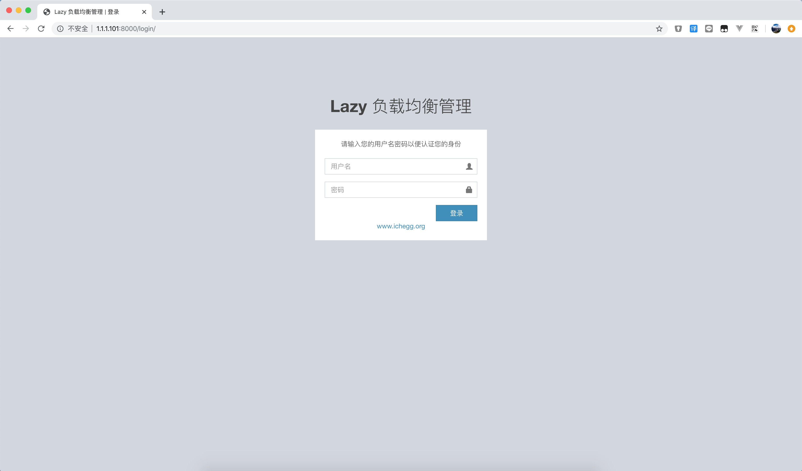
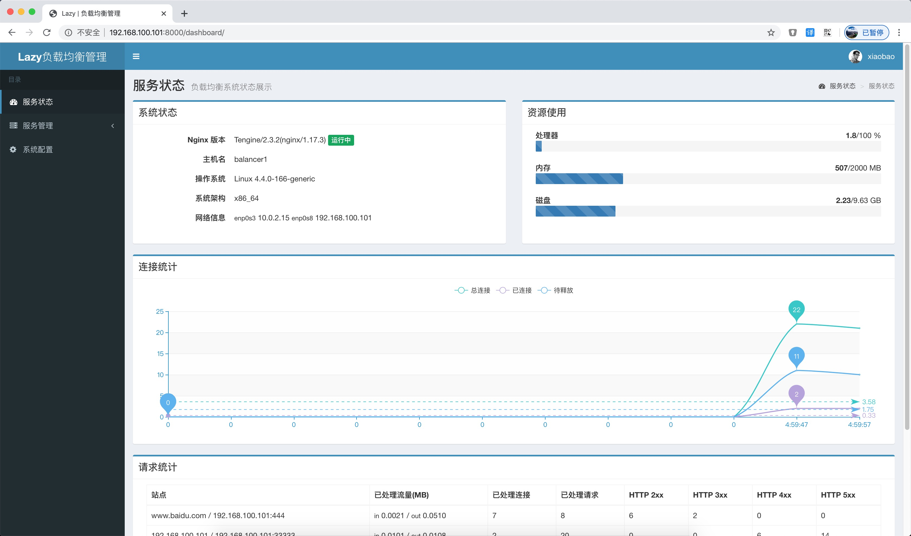
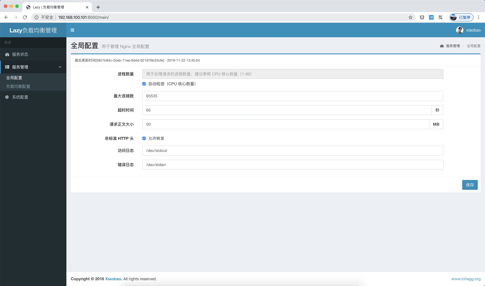
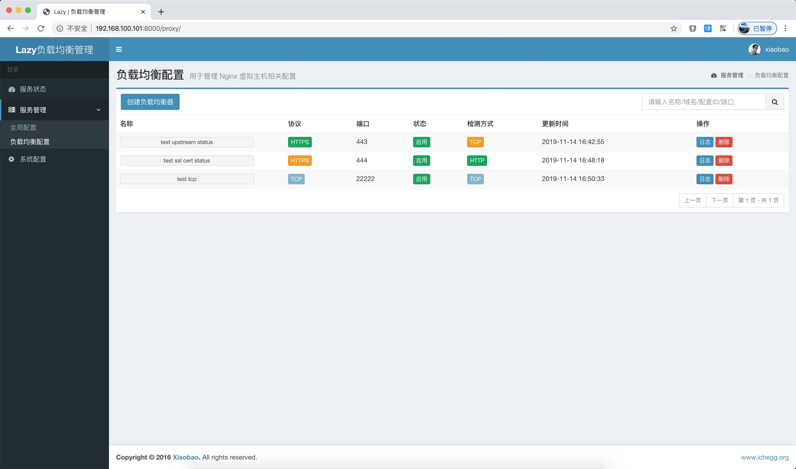
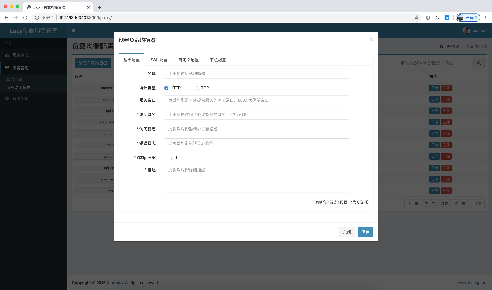
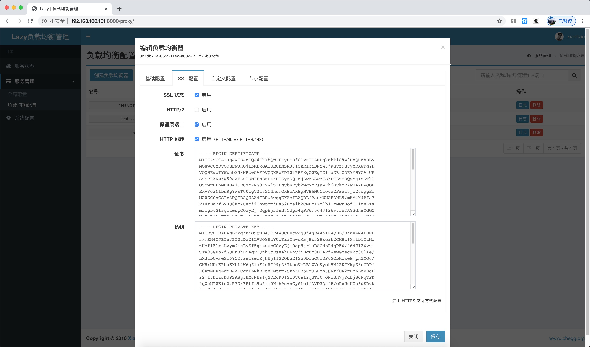
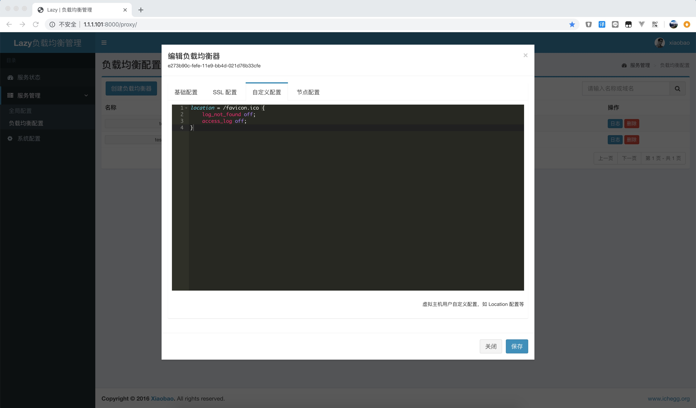
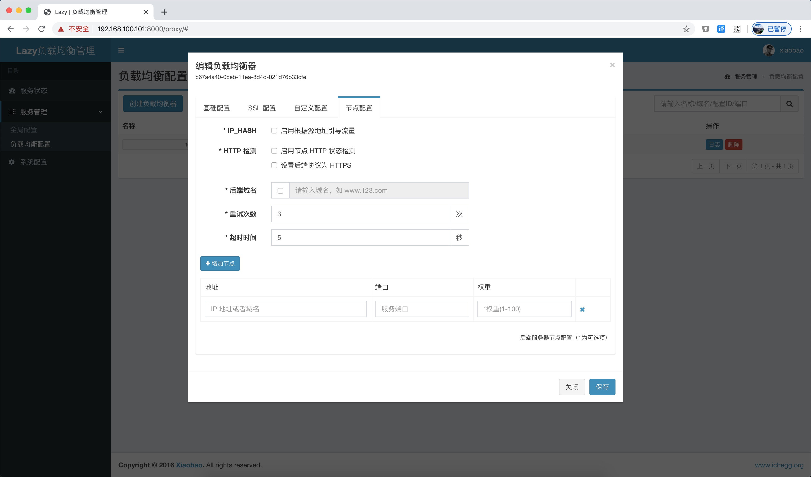
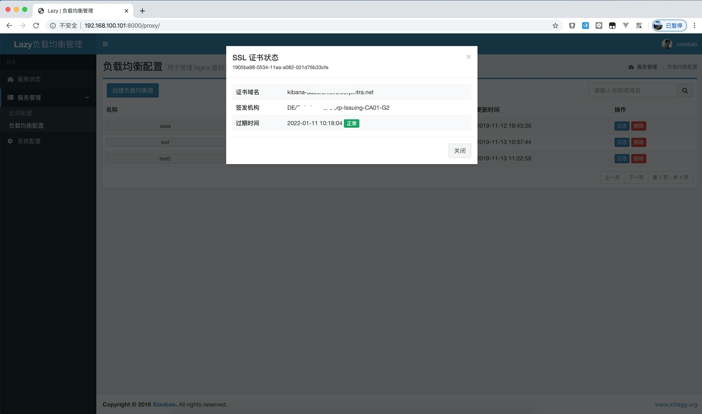
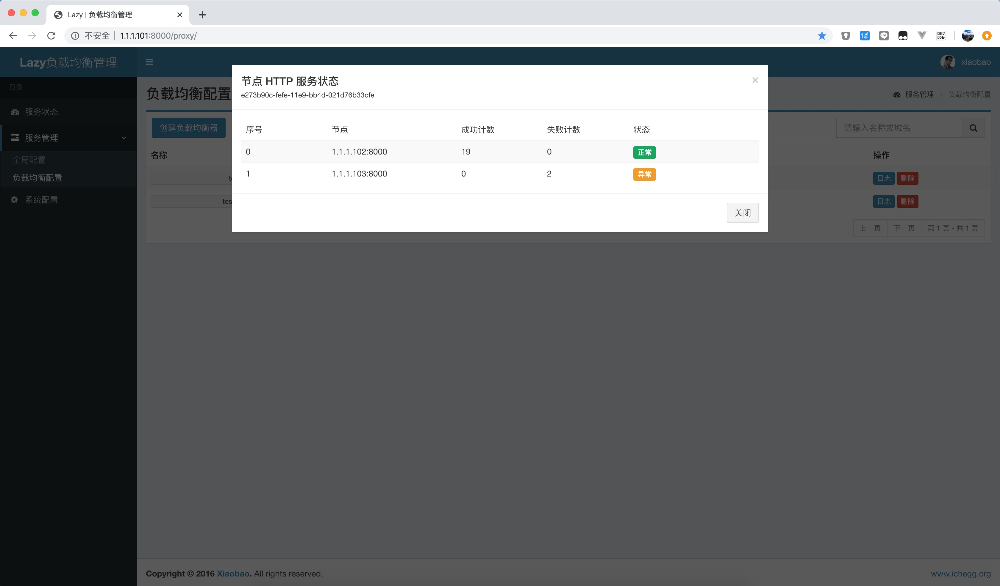
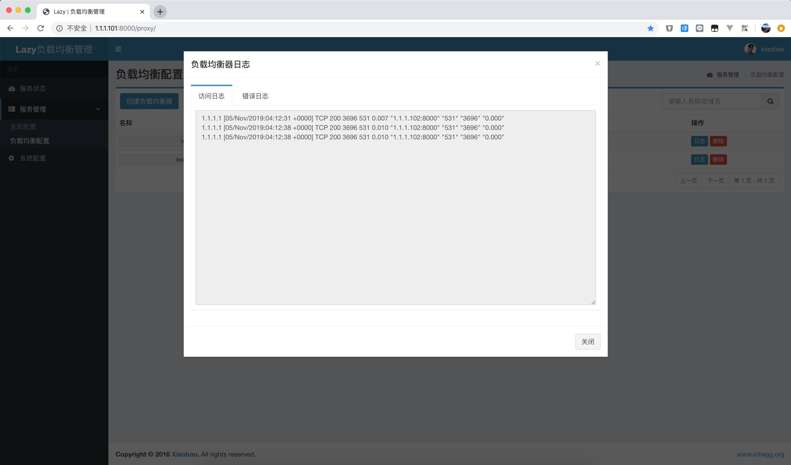

## 授权
本项目由 [小宝](http://www.ichegg.org) 维护，采用 [GPLv3](http://www.gnu.org/licenses/gpl-3.0.html) 开源协议。欢迎反馈！欢迎贡献代码！
